# 100 Days of SwiftUI (2025)

Welcome to my repository for [100 Days of SwiftUI](https://www.hackingwithswift.com/100/swiftui).
This repository will contain all my projects for this tutorial.

## Completed Projects

| Project | Screenshot |
| ------- | ---------- |
| WeSplit   Day: 16 - 18   Completed on 21 May 2025 | 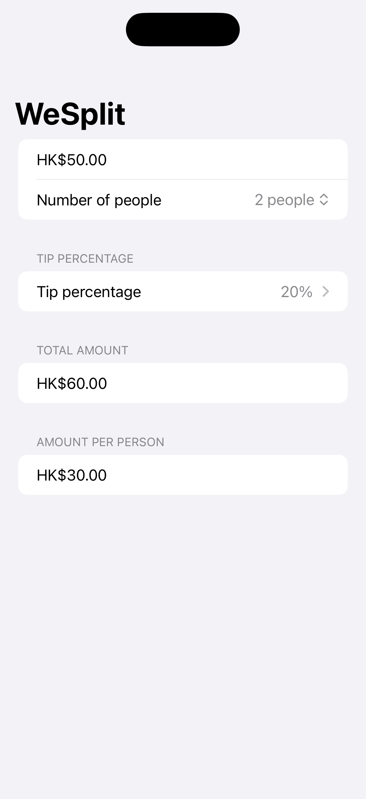 |
| UnitConverter   Day: 19   Completed on 22 May 2025 | 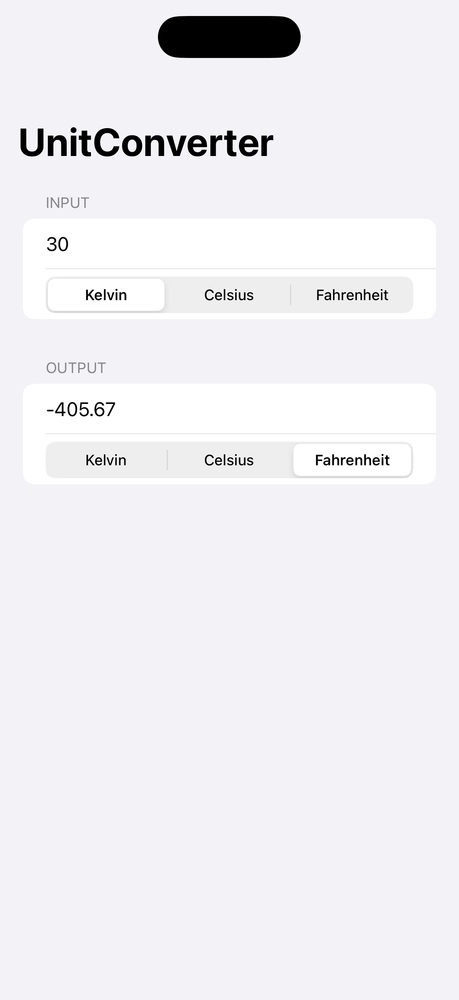 |
| GuessTheFlag   Day: 20 - 22   Completed on 22 May 2025 | 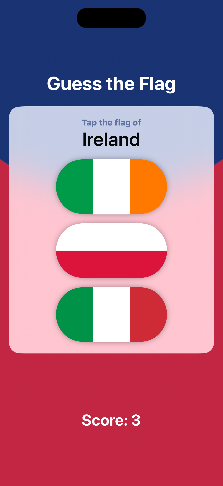 |
| ViewAndModifier   Day: 23 - 24   Completed on 23 May 2025 | 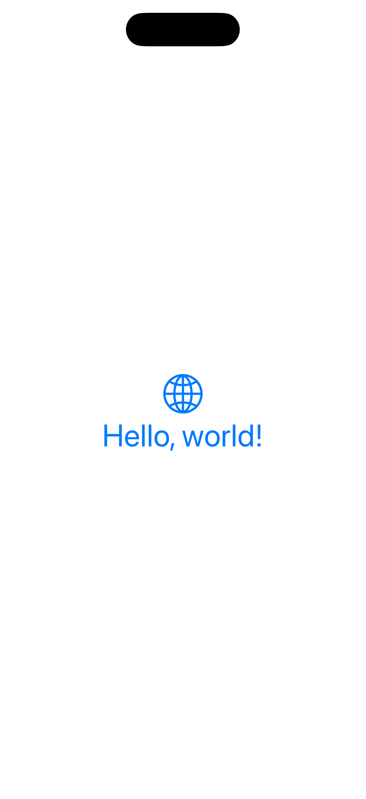 |
| BetterRest   Day: 26 - 28   Completed on 25 May 2025 | 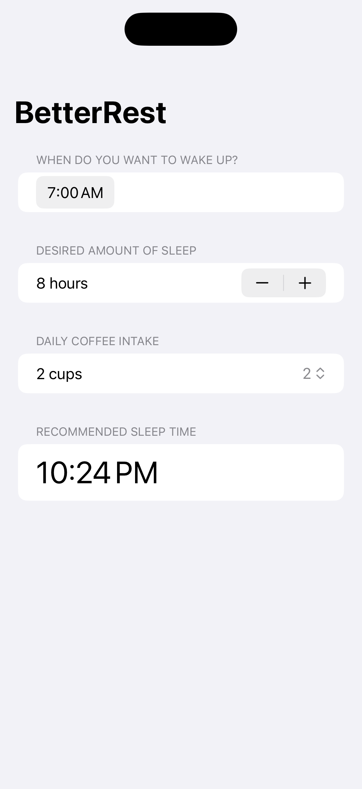 |
| WordScramble   Day: 29 - 31   Completed on 26 May 2025 | 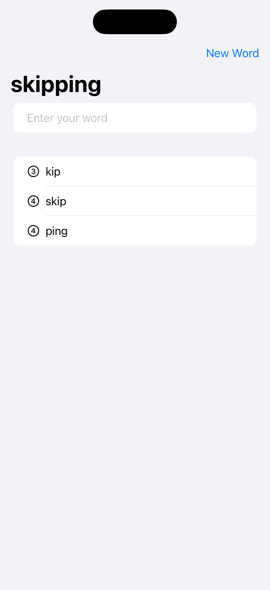 |
| iExpense   Day: 36 - 38   Completed on 27 May 2025 | 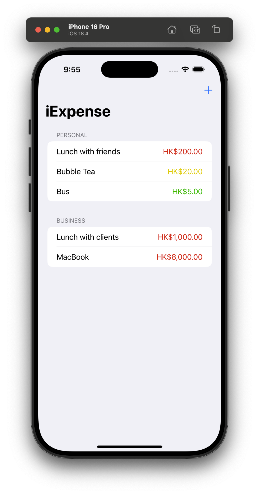 |
| Moonshot   Day: 39 - 42   Completed on 28 May 2025 | 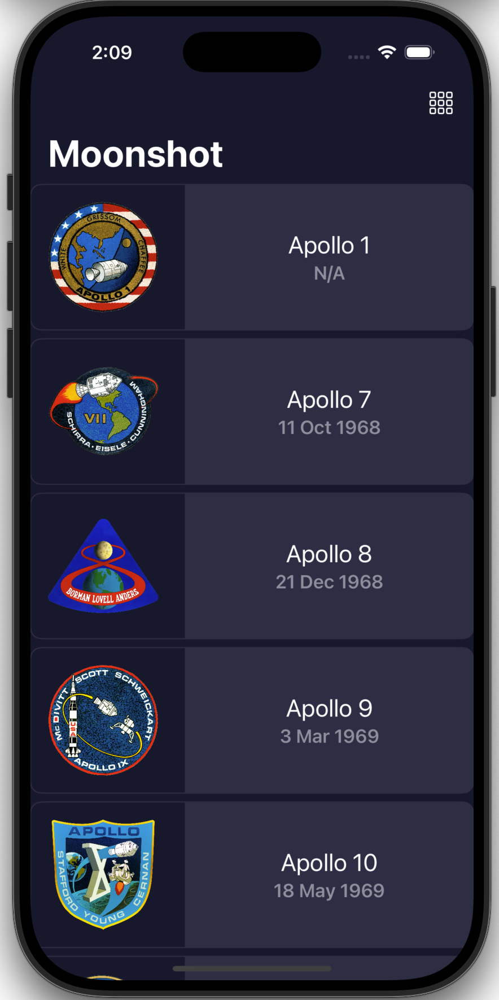 |
| HabitTracker   Day: 47   Completed on 29 May 2025 | 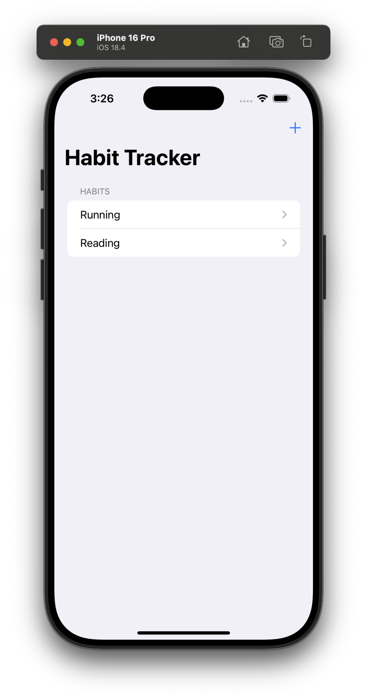 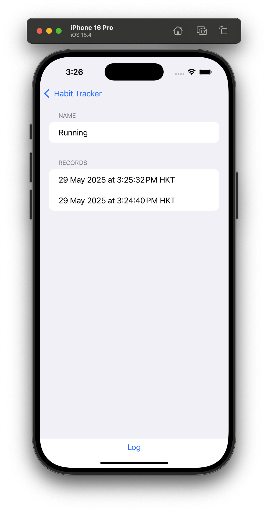 |
| CupcakeCorner   Day: 49 - 52   Completed on 31 May 2025 | 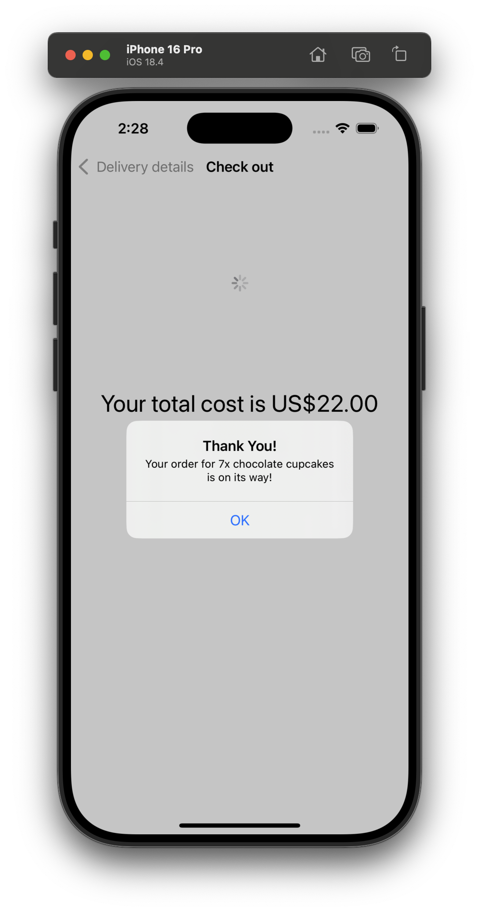 |
| Bookworm   Day: 53 - 56   Completed on 1 June 2025 | 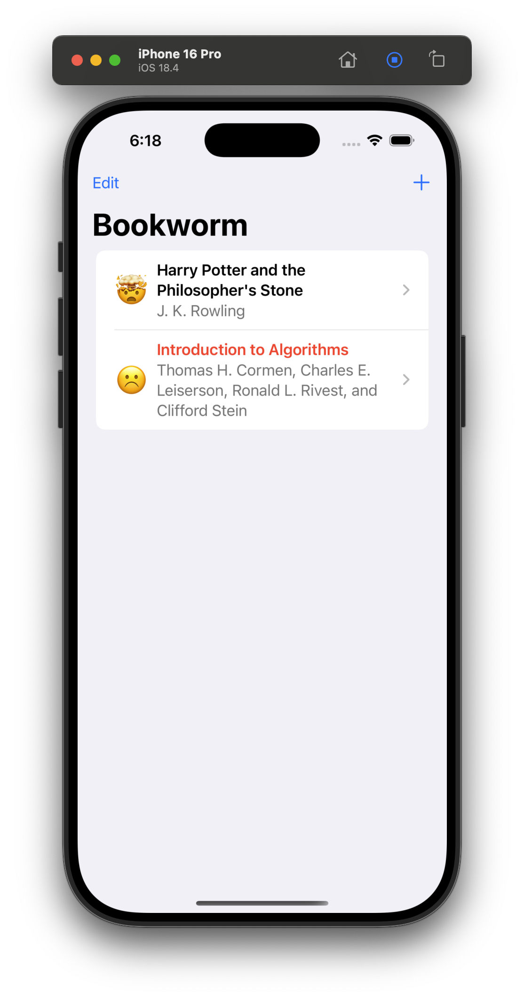 |
| Instafilter   Day: 62 - 67   Completed on 5 June 2025 | 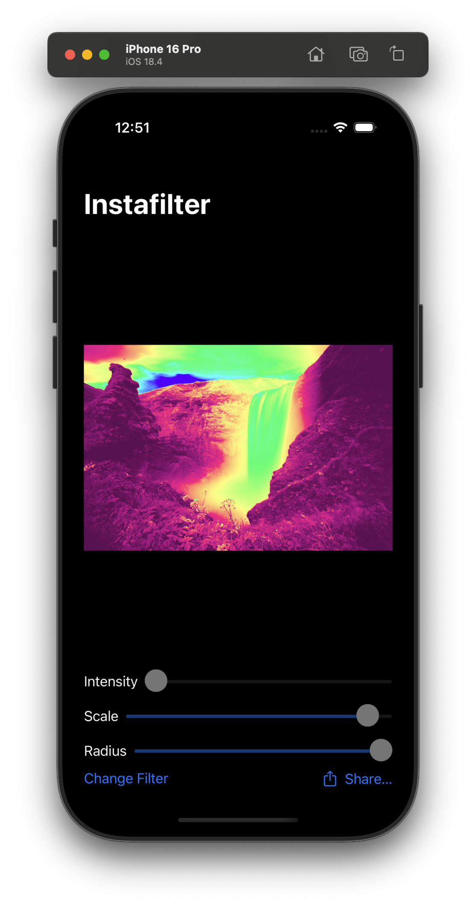 |
| BucketList   Day: 68 - 73   Completed on 6 June 2025 | 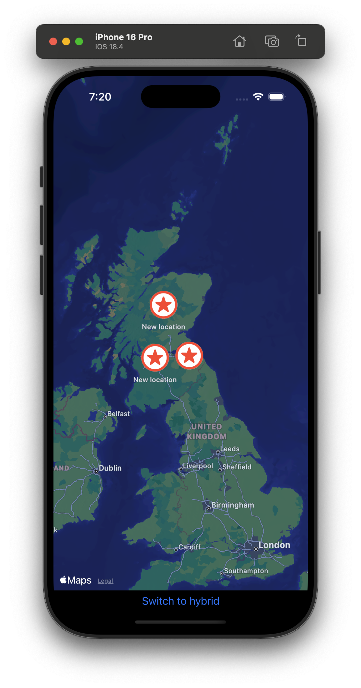 |